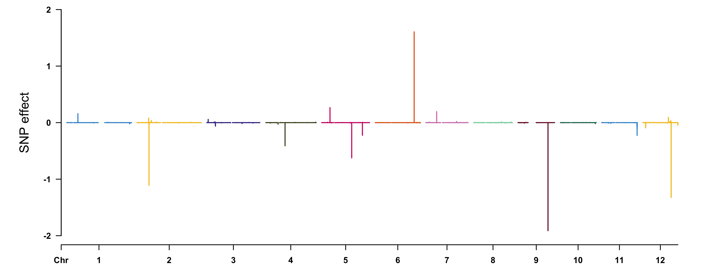
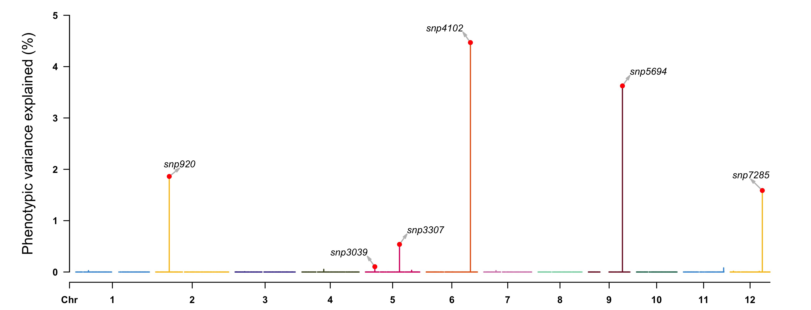
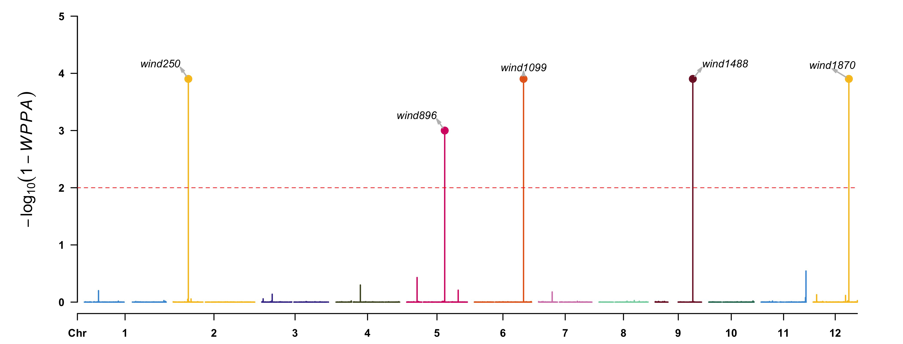
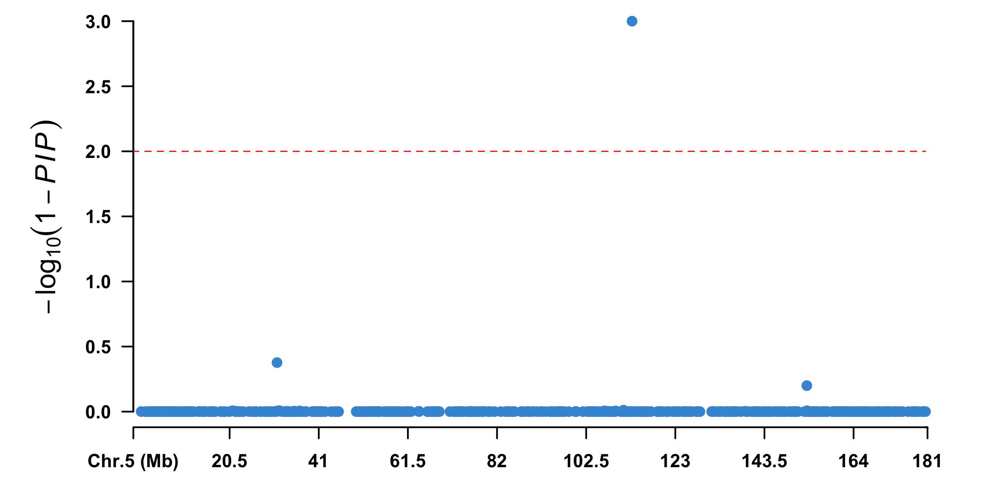

# hibayes 
[](https://github.com/YinLiLin/hibayes/issues/new)  [](https://CRAN.R-project.org/package=hibayes) []()  [](https://CRAN.R-project.org/package=hibayes) <a href="https://hits.seeyoufarm.com"/></a>
## Individual-Level, Summary-Level and Single-Step Bayesian Regression Models for Genomic Prediction and Genome-Wide Association Studies

**```hibayes```** (say 'Hi' to Bayes) is an user-friendly [R](https://www.r-project.org) package to fit 3 types of Bayesian models using **[individual-level](#1-individual-level-bayesian-model)**, **[summary-level](#2-summary-level-bayesian-model)**, and **[individual plus pedigree-level](#3-single-step-bayesian-model)** (single-step) data for both Genomic prediction/selection (GS) and Genome-Wide Association Study (GWAS), it was designed to estimate joint effects and genetic parameters for a complex trait, including:  
**(1)** fixed effects and coefficients of covariates  
**(2)** environmental random effects, and its corresponding variance  
**(3)** genetic variance  
**(4)** residual variance  
**(5)** heritability  
**(6)** genomic estimated breeding values (*GEBV*) for both genotyped and non-genotyped individuals  
**(7)** SNP effect size  
**(8)** phenotype/genetic variance explained (*PVE*) for single or multiple SNPs  
**(9)** posterior probability of association of the genomic window (*WPPA*)  
**(10)** posterior inclusive probability (*PIP*)  
The functions are not limited, we will keep on going in enriching **```hibayes```** with more features.

**```hibayes```** is written in C++ by aid of Rcpp and RcppArmadillo, some time-consuming functions are enhanced with [LAPACK](http://www.netlib.org/lapack/) package, it is recommended to run **```hibayes```** in [**MRO**](https://mran.microsoft.com) instead of **R**, as the BLAS/LAPACK library can be accelerated automatically in multi-threads by MKL library, which would significantly reduce computation time. 

***If you have any bug reports or questions, please feed back :point_right:[here](https://github.com/YinLiLin/hibayes/issues/new):point_left:.***

## Installation
The stable version of **```hibayes```** can be accessed from CRAN, type the following script to install:
```r
> install.packages("hibayes")
```
After installed successfully, type *```library(hibayes)```* to use.  
The latest version of **```hibayes```**  in development can be installed from GitHub as following, please ensure **```devtools```** has been installed prior to installing **```hibayes```**.
```r
> devtools::install_github("YinLiLin/hibayes")
```
## Citing for the package
Yin LL, Zhang HH, Li XY, Zhao SH, Liu XL. [hibayes: An R Package to Fit Individual-Level, Summary-Level and Single-Step Bayesian Regression Models for Genomic Prediction and Genome-Wide Association Studies](https://www.biorxiv.org/content/10.1101/2022.02.12.480230v1), ***bioRxiv*** (2022), doi: 10.1101/2022.02.12.480230.
## Usage
### 1. Individual level Bayesian model
To fit individual level Bayesian model (*```bayes```*), at least the phenotype(***n***), numeric genotype (***n*** * ***m***, ***n*** is the number of individuals, ***m*** is the number of SNPs) should be provided. Users can load the phenotype and genotype data that coded by other softwares by *```read.table```* to fit model, note that 'NA' is not allowed in genotype data:
```r
> pheno = read.table("your_pheno.txt")
> geno = read.table("your_geno.txt") # genotype should be coded in digits (either 0, 1, 2 or -1, 0, 1 is acceptable)
> geno.id = read.table("your_genoid.txt")
> # the order of individuals should be exactly the same between phenotype and genotype
> pheno = pheno[match(geno.id[, 1], pheno[, 1]), ]   # supposing the first column is the individual id
```
Additionally, we pertinently provide a function *```read_plink```* to load [PLINK binary files](http://zzz.bwh.harvard.edu/plink/binary.shtml) into memory. For example, load the attached tutorial data in **```hibayes```**:
```r
> bfile_path = system.file("extdata", "example", package = "hibayes")
> data = read_plink(bfile=bfile_path, mode="A", threads=4)
> # bfile: the prefix of binary files
> # mode: "A" (additive) or "D" (dominant)
> pheno = data$fam
> nrow(pheno) # number of individuals
[1] 4798
> geno = data$geno
> dim(geno) # number of individuals and markers
[1] 4798 7385
> geno[1:5,1:5]
     [,1] [,2] [,3] [,4] [,5]
[1,]    0    0    0    0    1
[2,]    0    0    0    0    0
[3,]    0    0    0    0    1
[4,]    1    1    0    1    0
[5,]    1    0    1    1    0
> map = data$map
> head(map)
   SNP Chr     Pos A1 A2
1 snp1   1 1198554  T  C
2 snp2   1 1720354  A  G
3 snp3   1 1825948  A  C
4 snp4   1 3428453  G  A
5 snp5   1 4195032  T  C
6 snp6   1 4412357  T  C
```
In this function, missing genotype will be replaced by the major genotype of each allele. **```hibayes```** will code the genotype ***A1A1*** as 2, ***A1A2*** as 1, and ***A2A2*** as 0, where ***A1*** is the first allele of each marker in *\*.bim* file, therefore the estimated effect size is on ***A1*** allele, users should pay attention to it when a process involves marker effect. By default, the memory-mapped files are directed into work directory, users could redirect to new path as following:
```r
> data <- read_plink(bfile=bfile_path, out="./test")
> # directly use the genotype for the next time, no need to use 'read_plink' again:
> geno <- attach.big.matrix("./test.desc")
> map <- read.table("./test.map", header=TRUE)
```
For **fixed effects** and **covariates**, please use *```model.matrix.lm()```* to make the model matrix prior to fitting models:
```r
> # For fixed effects, use 'as.factor', eg. 'sex'. 
> # For covariates, use 'as.numeric', eg. 'weight'.
> X <- model.matrix.lm(~as.factor(sex)+as.numeric(weight), data=pheno, na.action = "na.pass")
> X <- X[, -1] #remove the intercept
```
We can also fit the interactions between environmental effects, for example:
```r
> X <- model.matrix.lm(~as.factor(sex)+as.numeric(weight)+
   as.factor(group:location), data=pheno, na.action = "na.pass")
> X <- X[, -1] #remove the intercept
```
For **random effects**, no needs to convert, just pick them out from the phenotype data, eg. 'group', 'location':
```r
> R <- pheno[, c("group", "location")]
```
Then assign it to different model:
```r
fit <- bayes(..., X=X, R=R, ...)    # bayes model
fit <- ssbayes(..., X=X, R=R, ...)  # single-step bayes model
```
Following methods are available currently, including:
 - ***"BayesRR":*** Bayesian Ridge Regression, all SNPs have non-zero effects and share the same variance, equals to RRBLUP or GBLUP. 
 - ***"BayesA":*** all SNPs have non-zero effects, and take different variance which follows an inverse chi-square distribution. 
 - ***"BayesB":*** only a small proportion of SNPs (1-Pi) have non-zero effects, and take different variance which follows an inverse chi-square distribution. 
 - ***"BayesBpi":*** the same with "BayesB", but 'Pi' is not fixed. 
 - ***"BayesC":*** only a small proportion of SNPs (1-Pi) have non-zero effects, and share the same variance. 
 - ***"BayesCpi":*** the same with "BayesC", but 'Pi' is not fixed. 
 - ***"BayesL":*** BayesLASSO, all SNPs have non-zero effects, and take different variance which follows an exponential distribution.
 - ***"BSLMM":*** all SNPs have non-zero effects, and take the same variance, but a small proportion of SNPs have additional shared variance. 
 - ***"BayesR":*** only a small proportion of SNPs have non-zero effects, and the SNPs are allocated into different groups, each group has the same variance. 

Type *```?bayes```* to see details of all parameters.

#### (a) Gemonic prediction/selection
```r
> fit <- bayes(bayes(y = pheno[, 6], M = geno, model = "BayesCpi", niter = 20000, 
		Pi = c(0.95, 0.05), nburn = 12000, outfreq=100)
> SNPeffect <- fit$alpha
> gebv <- fit$g
> pve <- apply(as.matrix(geno),2,var) * (fit$alpha^2) / var(pheno[, 6])    # the phenotypic variance explained for each SNPs
```
View the results by [CMplot](https://github.com/YinLiLin/R-CMplot) package:
```r
> source("https://raw.githubusercontent.com/YinLiLin/R-CMplot/master/R/CMplot.r")
> CMplot(cbind(map[,1:3], SNPeffect), type="h", plot.type="m", LOG10=FALSE, ylab="SNP effect")
```
<p align="center">
<a href="https://raw.githubusercontent.com/YinLiLin/hibayes/master/figure/SNPeff.jpg">

</a>
</p>

```r
> highlight <- map[pve>0.001,1]
> CMplot(cbind(map[, 1:3], 100 * pve), type = "h", plot.type = "m",
	LOG10 = FALSE, ylab = "Phenotypic variance explained (%)",
	highlight = highlight, highlight.text = highlight)
```
<p align="center">
<a href="https://raw.githubusercontent.com/YinLiLin/hibayes/master/figure/PVE.jpg">

</a>
</p>

#### (b) Gemone-Wide association study
**WPPA** is defined to be the window posterior probability of association, it is estimated by counting the number of MCMC samples in which the effect size is nonzero for at least one SNP in the window. To run GWAS, *```map```* should be provided, every marker should have clear physical position for the downstream genome cutting, and also the argument *```windsize```* or *```windnum```* should be specified, the argument *```windsize```* is used to control the size of the windows, the number  of markers in a window is not fixed. Contrarily, the argument *```windnum```*, e.g. windnum = 10, can be used to control the fixed number of markers in a window, the size for the window is not fixed for this case.
```r
> fit <- bayes(y = pheno[, 6], M = geno, model = "BayesCpi", niter = 20000,
		Pi = c(0.95, 0.05), nburn = 12000, outfreq = 100, seed = 666666,
		map = map, windsize = 1e6)
> gwas <- fit$gwas
> head(gwas)
   Wind Chr N   Start     End     WPPA
1 wind1   1 3 1198554 1825948 0.001250
2 wind2   1 1 3428453 3428453 0.000500
3 wind3   1 8 4195032 4916148 0.013250
4 wind4   1 7 5109162 5881216 0.007500
5 wind5   1 3 6705835 6952985 0.003125
6 wind6   1 7 7075618 7863025 0.004375
```
View the results by [CMplot](https://github.com/YinLiLin/R-CMplot) package:
```r
> highlight <- gwas[(1 - gwas[, "WPPA"]) < 0.01, 1]
> CMplot(cbind(gwas[, c(1, 2, 4)], 1 - gwas[, "WPPA"]), type = "h",
	plot.type = "m", LOG10 = TRUE, threshold = 0.01, ylim = c(0, 5),
	ylab = expression(-log[10](1 - italic(WPPA))), highlight = highlight,
	highlight.col = NULL, highlight.text = highlight)
```
<p align="center">
<a href="https://raw.githubusercontent.com/YinLiLin/hibayes/master/figure/WPPA.jpg">

</a>
</p>

One can also derive the association significance from the posterior inclusive probability (**PIP**) of each SNP for certain genome region in whole MCMC procedure.
```r
> data <- cbind(map[, 1:3], (1 - fit[["pip"]]))
> chr5 <- data[data[, 2] == 5, ]
> # visualize the results
> CMplot(chr5, plot.type = "m", width = 9, height = 5, threshold = 0.01,
	ylab = expression(-log[10](1 - italic(PIP))), LOG10 = TRUE,
	amplify = FALSE)
```
<p align="center">
<a href="https://raw.githubusercontent.com/YinLiLin/hibayes/master/figure/PIP.jpg">

</a>
</p>

-----

### 2. Summary level Bayesian model
To fit summary level data based Bayesian model (*```sbayes```*), the variance-covariance matrix calculated from the reference panel (can be done by **```hibayes```**), and summary data in [COJO](https://cnsgenomics.com/software/gcta/#COJO) file format should be provided. Specially, if the summary data is derived from reference panel, means that all data come from the same population, then summary data level based Bayesian model equals to the individual level Bayesian model. 

The available methods for *```sbayes```* include ***"BayesRR", "BayesA", "BayesLASSO", "BayesB", "BayesBpi", "BayesC", "BayesCpi", "BayesR", "CG" (conjuction gradient)***. For 'CG' method, parameter *```lambda```* should be assigned with *```m * (1 / h2 - 1)```*, where ***m*** is the total number of SNPs and ***h2*** is the heritability that can be estimated from LD score regression analysis using the summary data.

#### Step1: construct full/sparse LD variance-covariance matrix
Sparse matrix could significantly reduce the memory cost by setting some of elements of full matrix to zero, on condition that *```n*r^2 < chisq```*, where ***n*** is the number of individuals, ***r*** is the LD correlation of pairs of SNPs, some low LD values would be replaced by 0.
```r
> # load reference panel
> bfile_path = system.file("extdata", "geno", package = "hibayes")
> data = read_plink(bfile_path)
> geno = data$geno
> map = data$map
> # construct LD variance-covariance matrix
> ldm1 = ldmat(geno, threads=4)   #chromosome wide full ld matrix
> ldm2 = ldmat(geno, chisq=5, threads=4)   #chromosome wide sparse ld matrix
> ldm3 = ldmat(geno, map, ldchr=FALSE, threads=4)   #chromosome block ld matrix
> ldm4 = ldmat(geno, map, ldchr=FALSE, chisq=5, threads=4)   #chromosome block + sparse ld matrix
```
From ```ldm1``` to ```ldm4```, the memory cost less, but the model stability of *```sbayes```* would be worse.

#### Step2: fit SBayes model
If the order of SNPs in variance-covariance matrix is not consistent with the order in summary data file, prior adjusting is necessary.
```r
> sumstat_path = system.file("extdata", "geno.ma", package = "hibayes")
> sumstat = read.table(sumstat_path, header=TRUE)
> head(sumstat)
   SNP A1 A2    MAF    BETA     SE      P NMISS
1 snp1  G  A 0.3000  0.1783 0.3215 0.5813    60
2 snp2  T  G 0.3667  0.1451 0.2735 0.5978    60
3 snp3  A  G 0.3167  0.3815 0.3363 0.2613    60
4 snp4  C  A 0.3417  0.3699 0.3286 0.2649    60
5 snp5  T  G 0.3250  0.5380 0.3522 0.1321    60
6 snp6  T  G 0.3000 -0.2677 0.3346 0.4270    60
> sumstat = sumstat[match(map[,1], sumstat[,1]), ]  # match the order of SNPs
```
Note that **```hibayes```** only use the 'BETA', 'SE' and 'NMISS' columns.  
Type *```?sbayes```* to see details of all parameters.
#### (a) Gemonic prediction/selection
```r
> fit = sbayes(sumstat=sumstat, ldm=ldm1, model="SBayesCpi", niter=20000, nburn=12000, outfreq=100)
```
#### (b) Gemone-Wide association study
```r
> fit = sbayes(sumstat=sumstat, ldm=ldm1, map=map, model="SBayesCpi", windsize=1e6, wppa=0.01, niter=20000, nburn=12000)
```

-----

### 3. Single-step Bayesian model
To fit single-step Bayesian model (*```ssbayes```*), at least the phenotype(***n1***, the number of phenotypic individuals), numeric genotype (***n2*** * ***m***, ***n2*** is the number of genotyped individuals, ***m*** is the number of SNPs), and pedigree information (***n3*** * ***3***, the three columns are "id" "sir" "dam" orderly) should be provided, ***n1***, ***n2***, ***n3*** can be different, all the individuals in pedigree will be predicted, including genotyped and non-genotyped, therefore the total number of predicted individuals depends on the number of unique individuals in pedigree.  
For example, load the attached tutorial data in **```hibayes```**:
```r
> # load phenotype file
> pheno_file_path = system.file("extdata", "pheno.txt", package = "hibayes")
> pheno = read.table(pheno_file_path, header=TRUE)
> nrow(pheno) # number of individuals
[1] 100
> head(pheno)
    id          y scale group sex
1 ind1 -0.5796816  0.77    g1   m
2 ind2 -2.0224628 -1.02    g2   m
3 ind3 -1.4807132  0.52    g1   f
4 ind4 -3.0303065 -1.05    g4   m
5 ind5  2.1881874  2.06    g3   m
6 ind6 -3.2110719 -1.94    g4   m
> # load pedigree file
> pedigree_file_path = system.file("extdata", "ped.txt", package = "hibayes")
> ped = read.table(pedigree_file_path, header=TRUE)
> head(ped)
     id  sire   dam
1 ind20  <NA>  <NA>
2 ind21 ind17 ind12
3 ind22  ind3 ind20
4 ind23  ind4 ind16
5 ind24  ind1 ind14
6 ind25  ind5 ind13
> # load genotype file
> bfile_path = system.file("extdata", "geno", package = "hibayes")
> data = read_plink(bfile=bfile_path, mode="A", threads=4)
> # bfile: the prefix of binary files
> # mode: "A" (addtive) or "D" (dominant)
> fam = data$fam
> geno = data$geno
> map = data$map
> dim(geno) # number of genotyped individuals and markers
[1]   60 1000
> # get the of phenotype and genotype id
> geno.id = fam[, 2]
> pheno.id = pheno[, 1]
```
For fixed effects, covariates, and environmental random effects, please refer to the chapter of [*bayes*](#1-individual-level-bayesian-model) model.

***NOTE:*** for *```ssbayes```* model, there is no NEED to adjust the order of id in different files.

The available methods for *```ssbayes```* model are consistent with *```bayes```* model, except for "BSLMM". Type *```?ssbayes```* to see details of all parameters.

#### (a) Gemonic prediction/selection
```r
> fit = ssbayes(y=pheno[, 2], y.id=pheno.id, M=geno, M.id=geno.id, P=ped, 
				model="BayesR", niter=20000, nburn=12000, outfreq=100)
```
#### (b) Gemone-Wide association study
```r
> fit = ssbayes(y=pheno[, 2], y.id=pheno.id, M=geno, M.id=geno.id, P=ped, 
			  map=map, windsize=1e6, model="BayesCpi")
```

## Citing for the methods
For *```bayes```* model, please cite following papers:
```
1. Meuwissen, Theo HE, Ben J. Hayes, and Michael E. Goddard. "Prediction of total genetic value using genome-wide dense marker maps." Genetics 157.4 (2001): 1819-1829.
2. de los Campos, G., Hickey, J. M., Pong-Wong, R., Daetwyler, H. D., and Calus, M. P. (2013). Whole-genome regression and prediction methods applied to plant and animal breeding. Genetics, 193(2), 327-345.
3. Habier, David, et al. "Extension of the Bayesian alphabet for genomic selection." BMC bioinformatics 12.1 (2011): 1-12.
4. Yi, Nengjun, and Shizhong Xu. "Bayesian LASSO for quantitative trait loci mapping." Genetics 179.2 (2008): 1045-1055.
5. Zhou, Xiang, Peter Carbonetto, and Matthew Stephens. "Polygenic modeling with Bayesian sparse linear mixed models." PLoS genetics 9.2 (2013): e1003264.
6. Moser, Gerhard, et al. "Simultaneous discovery, estimation and prediction analysis of complex traits using a Bayesian mixture model." PLoS genetics 11.4 (2015): e1004969.
```
For *```sbayes```* model, please cite following papers:
```
Lloyd-Jones, Luke R., et al. "Improved polygenic prediction by Bayesian multiple regression on summary statistics." Nature communications 10.1 (2019): 1-11.
```
For *```ssbayes```* model, please cite following papers:
```
1. Fernando, Rohan L., Jack CM Dekkers, and Dorian J. Garrick. "A class of Bayesian methods to combine large numbers of genotyped and non-genotyped animals for whole-genome analyses." Genetics Selection Evolution 46.1 (2014): 1-13.
2. Henderson, C.R.: A simple method for computing the inverse of a numerator relationship matrix used in prediction of breeding values. Biometrics 32(1), 69-83 (1976).
```
