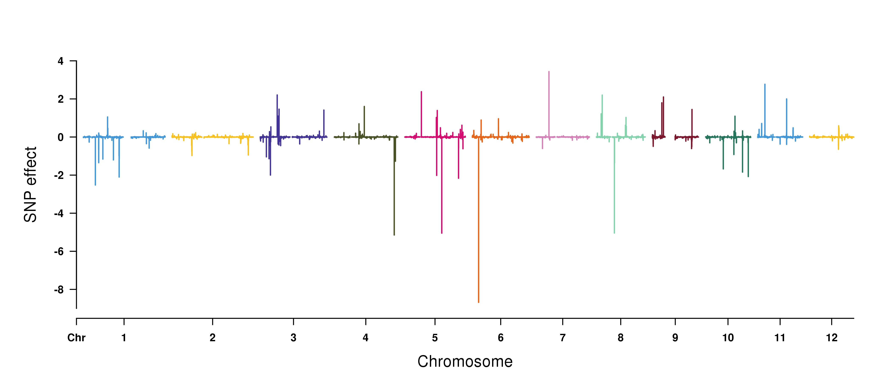
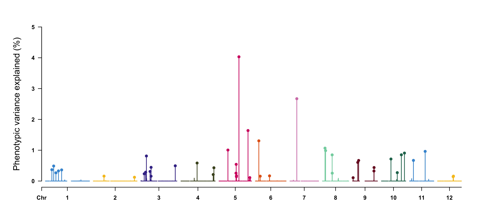
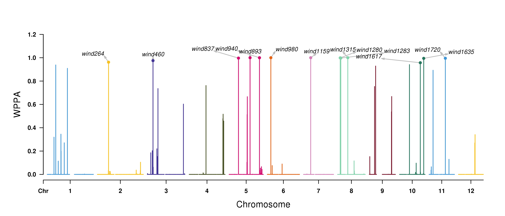
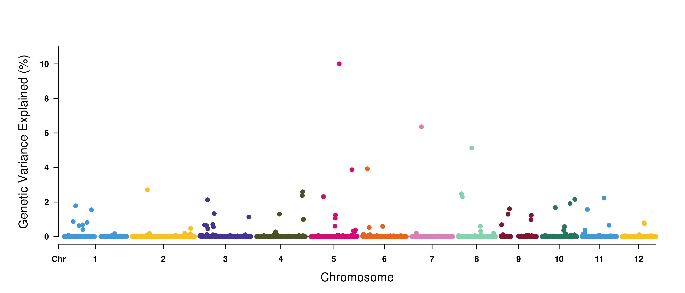

# hibayes [](https://github.com/YinLiLin/hibayes/issues/new) [](https://github.com/YinLiLin/hibayes)
## Individual and summary level data based BAYES model for Genome-Wide Association and Genomic Prediction

```hibayes``` is an user-friendly tool ([R](https://www.r-project.org) version of [GCTB](http://cnsgenomics.com/software/gctb/#Overview)) to fit BAYES model using individual-level data and summary-level data for both Genomic prediction/selection and Genome-Wide association study, it was desighed to estimate joint effects and genetic parameters for a complex trait, including 1)genetic variance, 2)residual variance, 3)heritability, 4)joint distribution of effect size, 5)phenotype/genetic variance explained (PVE) for single or multiple SNPs, and 6)posterior probability of association of the genomic window (WPPA). The functions are not limited, we will keep on going in enriching ```hibayes``` with more features.

```hibayes``` is developed by [Lilin Yin](https://github.com/YinLiLin) with the support of [Haohao Zhang](https://github.com/hyacz), [Xiaolei Liu](https://github.com/XiaoleiLiuBio), [Jian Zeng](http://researchers.uq.edu.au/researcher/14033) and [Jian Yang](https://researchers.uq.edu.au/researcher/2713). If you have any bug reports or questions, please feed back :point_right:[here](https://github.com/YinLiLin/hibayes/issues/new):point_left:.

## Installation
```hibayes``` can be installed from GitHub as folowing, please ensure ```devtools``` has been installed prior to ```hibayes```.
```r
> devtools::install_github("YinLiLin/hibayes")
```
After installed successfully, type ```library(hibayes)``` to use. The package is on its way to R CRAN, and would be coming soon.

## Usage
### Individual level bayes model
To fit individual level bayes model, the phenotype(n), numeric genotype (n * m, n is the number of individuals, m is the number of SNPs) should be provided. Uses can load the data that coded by other softwares by 'read.table' to fit model. Additionally, we pertinently provide a function ```read_plink``` to load [PLINK binary files](http://zzz.bwh.harvard.edu/plink/binary.shtml) into memory. For example, load the attached tutorial data in ```hibayes```:
```r
> bfile_path = system.file("extdata", "example", package = "hibayes")
> data = read_plink(bfile=bfile_path, mode="A", threads=4)
  ## bfile: the prefix of binary files
  ## model: "A" (addtive) or "D" (dominant)
> pheno = data$pheno
> geno = as.matrix(data$geno)
> map = data$map
```
Total 8 bayes models are available currently, including:
 - ***"BayesRR" (ridge regression):*** all SNPs have non-zero effects and share the same variance, equals to GBLUP.
 - ***"BayesA":*** all SNPs have non-zero effects but use different variance which follows an inverse chi-square distribution.
 - ***"BayesLASSO":*** all SNPs have non-zero effects but use different variance which follows an exponential distribution.
 - ***"BayesB":*** only a small part of SNPs (1-pi) have non-zero effects but use different variance which follows an inverse chi-square distribution.
 - ***"BayesBpi":*** the same with "BayesB", but 'pi' is not fixed.
 - ***"BayesC":*** only a small part of SNPs (1-pi) have non-zero effects and share the same variance.
 - ***"BayesCpi":*** the same with "BayesC", but 'pi' is not fixed.
 - ***"BayesR":*** only a small part of SNPs have non-zero effects, but the SNPs are allocated into different groups, each group has the same variance.
 
Type ```?bayes``` to see details of all parameters.

#### (1) Gemonic prediction/selection
```r
> fit <- bayes(y=pheno[, 1], X=geno, pi=0.95, model="BayesB", niter=20000, nburn=10000, outfreq=10, verbose=TRUE)
> SNPeffect <- fit$g
> gebv <- geno %*% SNPeffect    # calculate the estimated genomic breeding value
> pve <- apply(geno,2,var) * (fit$g^2) / var(pheno[,1])    # the phenotypic variance explained for each SNPs
> nonZeroRate <- fit$nzrate    # the rate of stepping into non-zero effects in MCMC iteration for each SNPs
```
View the results by [CMplot](https://github.com/YinLiLin/R-CMplot) package:
```r
> source("https://raw.githubusercontent.com/YinLiLin/R-CMplot/master/R/CMplot.r")
> CMplot(cbind(map, SNPeffect), type="h", plot.type="m", LOG10=FALSE, ylab="SNP effect")
```
<p align="center">
<a href="https://raw.githubusercontent.com/YinLiLin/hibayes/master/figure/1.jpg">

</a>
</p>

```r
> highlight <- map[pve>0.001,1]
> CMplot(cbind(map,nonZeroRate), type="h", plot.type="m", LOG10=FALSE, ylab="Phenotypic variance explained (%)",
        highlight=highlight, highlight.col=NULL)
```
<p align="center">
<a href="https://raw.githubusercontent.com/YinLiLin/hibayes/master/figure/2.jpg">

</a>
</p>

#### (2) Gemone-Wide association study
**WPPA** is defined to be the window posterior probability of association ([Fernando and Garrick (2013)](https://link.springer.com/protocol/10.1007/978-1-62703-447-0_10)), it is the ratio of the number of iterations that ***Pw*** (the proportion of the total genetic variance explained by the window ***w***) > 1% divided by the total number of MCMC iterations.
```r
> fit <- bayes(y=pheno[, 1], X=geno, map=map, windsize=1e6, wppa=0.01, model="BayesR", niter=20000, nburn=10000, outfreq=10)
> gwas <- fit$gwas
> head(gwas)
   WIND CHR NUM   START     END WPPA         WGVE
1 wind1   1   3 1198554 1825948    0 4.500114e-05
2 wind2   1   1 3428453 3428453    0 8.286156e-06
3 wind3   1   8 4195032 4916148    0 6.749507e-05
4 wind4   1   7 5109162 5881216    0 2.985705e-05
5 wind5   1   3 6705835 6952985    0 2.150887e-05
6 wind6   1   7 7075618 7863025    0 6.133333e-05
```
View the results by [CMplot](https://github.com/YinLiLin/R-CMplot) package:
```r
> highlight <- gwas[gwas$wppa>0.95, 1]
> CMplot(gwas[,c(1,2,4,6)], type="h", plot.type="m", LOG10=FALSE, ylab="WPPA", ylim=c(0,1.2), 
        highlight=highlight, highlight.col=NULL, highlight.text=highlight)
```
<p align="center">
<a href="https://raw.githubusercontent.com/YinLiLin/hibayes/master/figure/3.jpg">

</a>
</p>

```r
> # view the average proportion of Genetic Variance Explained for each Window
> CMplot(cbind(gwas[,c(1,2,4)],gwas$WGVE), type="p", plot.type="m", LOG10=FALSE, ylab="Genetic Variance Explained (%)")
> # the average proportion of Phenotypic Variance Explained for each Window cound be derived as following:
> WPVE <- gwas$WGVE * fit$vara / var(pheno[,1])
```
<p align="center">
<a href="https://raw.githubusercontent.com/YinLiLin/hibayes/master/figure/4.jpg">

</a>
</p>

### Summary level bayes model
Differently, to fit summary level data based bayes model (SBayes), the reference panel which is used to calculate LD matrix, and summary data in [COJO](https://cnsgenomics.com/software/gcta/#COJO) file format should be provided. Specially, if the summary data is derived from reference panel, means that all data come from the same population, then summary data level based bayes model equals to the individual level bayes model. 

The available models for SBayes include "SBayesRR", "SBayesA", "SBayesLASSO", "SBayesB", "SBayesBpi", "SBayesC", "SBayesCpi", "SBayesR", "CG" (conjuction gradient). For 'CG' model, parameter 'lambda' should be assigned with m * (1 / h2 - 1), where m is the total number of SNPs and h2 is the heritability that can be estimated from LD score regression analysis of the summary data.

#### Step1 construct full/sparse LD variance-covariance matrix
```r
> # load reference panel
> bfile_path = system.file("extdata", "example", package = "hibayes")
> data = read_plink(bfile_path)
> geno = data$geno
> map = data$map
> # construct LD variance-covariance matrix
> ldm1 = ldmat(geno, threads=4)   #chromosome wide full ld matrix
> ldm2 = ldmat(geno, chisq=5, threads=4)   #chromosome wide sparse ld matrix
> ldm3 = ldmat(geno, map, ldchr=FALSE, threads=4)   #chromosome block ld matrix
> ldm4 = ldmat(geno, map, ldchr=FALSE, chisq=5, threads=4)   #chromosome block + sparse ld matrix
```
From ```ldm1``` to ```ldm4```, the memory cost less, but the model stability of SBayes would be worse.

#### Step2 fit SBayes model
if the order of SNPs in genotype is not consistent with the order in summary data file, prior adjusting is necessary.
```r
> sumstat_path = system.file("extdata", "example.ma", package = "hibayes")
> sumstat = read.table(sumstat_path, header=TRUE)
> head(sumstat)
   SNP A1 A2     MAF    BETA     SE       P NMISS
1 snp1  C  A 0.25160 -0.4235 0.3594 0.23870  4798
2 snp2  C  A 0.08285 -0.2620 0.5579 0.63870  4798
3 snp3  C  A 0.17750 -0.7149 0.4099 0.08122  4798
4 snp4  C  A 0.35780 -0.5602 0.3230 0.08290  4798
5 snp5  C  A 0.08441  0.2736 0.5505 0.61920  4798
6 snp6  C  A 0.14130  0.2241 0.4441 0.61390  4798
> if(!all(map[,1] == sumstat[,1])){sumstat = sumstat[match(map[,1], sumstat[,1]), ]}
```
(1) Gemonic prediction/selection
```r
> fit = sbayes(sumstat=sumstat, ldm=ldm1, model="SBayesR", niter=20000, nburn=10000, outfreq=10, verbose=TRUE)
```
(2) Gemone-Wide association study
```r
> fit = sbayes(sumstat=sumstat, ldm=ldm1, map=map, model="SBayesR", windsize=1e6, wppa=0.01, niter=20000, nburn=10000)
```

## Citation
**For individual level bayes model:** <br>
```BayesA,B,Bpi:``` <br>
Meuwissen et al. (2001) Prediction of total genetic value using genome-wide dense marker maps. Genetics, 157: 1819-1829.<br>
```BayesC,Cpi:``` <br>
Habier et al. (2011) Extension of the Bayesian alphabet for genomic selection. BMC Bioinformatics, 12: 186.<br>
```BayesLASSO:``` <br>
Legarra, Andrés, et al. "Improved Lasso for genomic selection." Genetics research 93.1 (2011): 77-87.<br>
```BayesR:``` <br>
Moser et al. (2015) Simultaneous discovery, estimation and prediction analysis of complex traits using a Bayesian mixture model. PLoS Genetics, 11: e1004969.

**For summary level bayes model:** <br>
Lloyd-Jones, Zeng et al. (2019) Improved polygenic prediction by Bayesian multiple regression on summary statistics. Nature Communications, doi: 10.1101/522961.<br>
Zeng et al. (2019) Bayesian analysis of GWAS summary data reveals differential signatures of natural selection across human complex traits and functional genomic categories. bioRxiv, dio: 10.1101/752527.
