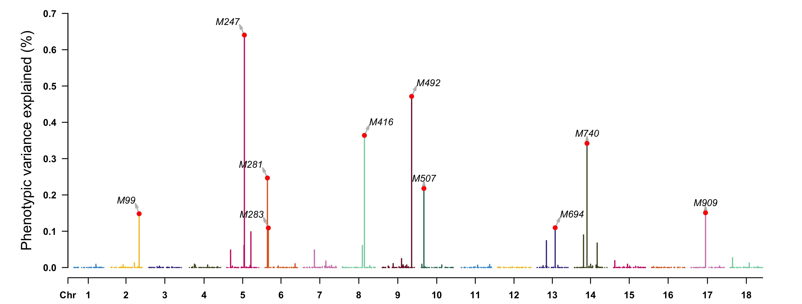

# hibayes 
[](https://github.com/YinLiLin/hibayes/issues/new)  [](https://CRAN.R-project.org/package=hibayes) []()  [](https://CRAN.R-project.org/package=hibayes) <a href="https://hits.seeyoufarm.com"/></a>
## Individual-Level, Summary-Level and Single-Step Bayesian Regression Models for Genomic Prediction and Genome-Wide Association Studies

**```hibayes```** (say 'Hi' to Bayes) is an user-friendly [R](https://www.r-project.org) package to fit 3 types of Bayesian models using **[individual-level](#1-individual-level-bayesian-model)**, **[summary-level](#2-summary-level-bayesian-model)**, and **[individual plus pedigree-level](#3-single-step-bayesian-model)** (single-step) data for both Genomic prediction/selection (GS) and Genome-Wide Association Study (GWAS), it was designed to estimate joint effects and genetic parameters for a complex trait, including:  
**(1)** fixed effects and coefficients of covariates  
**(2)** environmental random effects, and its corresponding variance  
**(3)** genetic variance  
**(4)** residual variance  
**(5)** heritability  
**(6)** genomic estimated breeding values (*GEBV*) for both genotyped and non-genotyped individuals  
**(7)** SNP effect size  
**(8)** phenotype/genetic variance explained (*PVE*) for single or multiple SNPs  
**(9)** posterior probability of association of the genomic window (*WPPA*)  
**(10)** posterior inclusive probability (*PIP*)  
The functions are not limited, we will keep on going in enriching **```hibayes```** with more features.

**```hibayes```** is written in C++ by aid of Rcpp and RcppArmadillo, some time-consuming functions are enhanced with [LAPACK](http://www.netlib.org/lapack/) package, it is recommended to link MKL (Math Kernel Library) with R for fast computing with big data (see [how to link MKL with R](https://www.intel.com/content/www/us/en/developer/articles/technical/quick-linking-intel-mkl-blas-lapack-to-r.html)), because the BLAS/LAPACK library can be accelerated automatically in multi-threads by MKL library, which would significantly reduce computational time. 

***If you have any bug reports or questions, please feed back :point_right:[here](https://github.com/YinLiLin/hibayes/issues/new):point_left:.***

## :toolbox: Relevant software tools for genetic analyses and genomic breeding
<table>
    <tr>
	<td><g-emoji class="g-emoji" alias="mailbox" fallback-src="https://github.githubassets.com/images/icons/emoji/unicode/1f4eb.png">📫</g-emoji> <strong><a href="https://www.hiblup.com/" rel="nofollow">HIBLUP</a></strong>: Versatile and easy-to-use GS toolbox.</td>
        <td><g-emoji class="g-emoji" alias="four_leaf_clover" fallback-src="https://github.githubassets.com/images/icons/emoji/unicode/1f340.png">🍀</g-emoji> <strong><a href="https://github.com/xiaolei-lab/SIMER">SIMER</a></strong>: data simulation for life science and breeding.</td>
    </tr>
    <tr>
        <td><g-emoji class="g-emoji" alias="biking_man" fallback-src="https://github.githubassets.com/images/icons/emoji/unicode/1f6b4-2642.png">🚴&zwj;♂️</g-emoji> <strong><a href="https://github.com/YinLiLin/KAML">KAML</a></strong>: Advanced GS method for complex traits.</td>
        <td><g-emoji class="g-emoji" alias="mountain_snow" fallback-src="https://github.githubassets.com/images/icons/emoji/unicode/1f3d4.png">🏔️</g-emoji> <strong><a href="http://ianimal.pro/" rel="nofollow">IAnimal</a></strong>: an omics knowledgebase for animals.</td>
    </tr>
    <tr>
        <td><g-emoji class="g-emoji" alias="postbox" fallback-src="https://github.githubassets.com/images/icons/emoji/unicode/1f4ee.png">📮</g-emoji> <strong><a href="https://github.com/xiaolei-lab/rMVP">rMVP</a></strong>: Efficient and easy-to-use GWAS tool.</td>
        <td><g-emoji class="g-emoji" alias="bar_chart" fallback-src="https://github.githubassets.com/images/icons/emoji/unicode/1f4ca.png">📊</g-emoji> <strong><a href="https://github.com/YinLiLin/CMplot">CMplot</a></strong>: A drawing tool for genetic analyses.</td>
    </tr>
</table>

## Installation
The stable version of **```hibayes```** can be accessed from CRAN, type the following script to install:
```r
> install.packages("hibayes")
```
After installed successfully, type *```library(hibayes)```* to use.  
The latest version of **```hibayes```**  in development can be installed from GitHub as following, please ensure **```devtools```** has been installed prior to installing **```hibayes```**.
```r
> devtools::install_github("YinLiLin/hibayes")
```
## Citing the package
Yin LL, Zhang HH, Li XY, Zhao SH, Liu XL. [hibayes: An R Package to Fit Individual-Level, Summary-Level and Single-Step Bayesian Regression Models for Genomic Prediction and Genome-Wide Association Studies](https://www.biorxiv.org/content/10.1101/2022.02.12.480230v2), ***bioRxiv*** (2022), doi: 10.1101/2022.02.12.480230.
## Usage
### 1. Individual level Bayesian model
To fit individual level Bayesian model (*```ibrm()```*), at least the phenotype, numeric genotype (***n*** * ***m***, ***n*** is the number of individuals, ***m*** is the number of SNPs) should be provided. Users can load the phenotype and genotype data that are coded from other software by *```read.table()```* to fit model, note that 'NA' is not allowed in genotype data:
```r
> pheno = read.table("your_pheno.txt")
> # genotype should be coded in digits (either 0, 1, 2 or -1, 0, 1 is acceptable)
> geno = read.table("your_geno.txt") 
> geno.id = read.table("your_genoid.txt")
```
the genotype and the names of genotyped individuals in the same order with genotype should be prepared separately, and the genotype matrix should be coded in digits, either in c(0, 1, 2) or c(-1, 0, 1) is acceptable.<br>
Additionally, we pertinently provide a function *```read_plink()```* to load [PLINK binary files](http://zzz.bwh.harvard.edu/plink/binary.shtml) into memory, and three memory-mapping files named "*.map", "*.desc", "*.id" and "*.bin" will be generated. For example, load the attached tutorial data in **```hibayes```**:
```r
> bfile_path <- system.file("extdata", "demo", package = "hibayes")
> bin <- read_plink(bfile = bfile_path, mode = "A", threads = 4)
> # bfile: the prefix of binary files
> # mode: "A" (additive) or "D" (dominant)
> fam <- bin[["fam"]]
> geno <- bin[["geno"]]
> map <- bin[["map"]]
```
In this function, missing genotype will be replaced by the major genotype of each allele. **```hibayes```** will code the genotype ***A1A1*** as 2, ***A1A2*** as 1, and ***A2A2*** as 0, where ***A1*** is the first allele of each marker in *\*.bim* file, therefore the estimated effect size is on ***A1*** allele, users should pay attention to it when a process involves marker effect.<br>
By default, the memory-mapped files are directed into the R temporary folder, users could redirect to a new work directory as follows:
```r
> bin <- read_plink(bfile = bfile_path, out = "./demo")
```
Note that this data conversion only needs to be done at the first time, at next time of use, no matter how big the number of individuals or markers in the genotype are, the memory-mapping files could be attached into memory on-the-fly within several minutes:
```r
> geno <- attach.big.matrix("./demo.desc")
> dim(geno)
[1]  600 1000
# the first dimension is the number of genotyped individuals, and the second is the number of genomic markers.
> print(geno[1:4, 1:5])
     [,1] [,2] [,3] [,4] [,5]
[1,]    2    1    1    1    0
[2,]    1    0    1    1    0
[3,]    0    2    0    0    0
[4,]    1    1    1    1    0
> geno.id <- fam[, 2]
> head(geno.id)
[1] "IND0701" "IND0702" "IND0703" "IND0704" "IND0705" "IND0706"
```
As shown above, the genotype matrix must be stored in numerical values. The map information with a column order of marker id, chromosome, physical position, major allele, minor allele is optional, it is only required when implementing GWAS analysis, the format is as follows:
```r
> head(map, 4)
  SNP CHROM      POS A1 A2
1  M1     1  4825340  G  T
2  M2     1  6371512  A  G
3  M3     1  7946983  G  A
4  M4     1  8945290  C  G
```
all the physical positions located at third column should be in digits because it will be used to cut the genome into smaller windows.

The phenotype data should include not only the phenotypic records, but also the covariates, fixed effects, and environmental random effects. ***NOTE that the first column of phenotype data must be the names of individuals***. Brief view of example phenotype data:
```r
> pheno_file_path <- system.file("extdata", "demo.phe", package = "hibayes")
> pheno <- read.table(pheno_file_path, header = TRUE)
> dim(pheno)
[1] 500   8
> head(pheno, 4)
       id  sex season day bwt loc     dam      T1
1 IND1001 Male Winter  92 1.2 l32 IND0921  4.7658
2 IND1002 Male Spring  88 2.7 l36 IND0921 12.4098
3 IND1003 Male Spring  91 1.0 l17 IND0968  4.8545
4 IND1004 Male Autumn  93 1.0 l37 IND0968 33.2217
```
Following methods are available currently, including:
 - ***"BayesRR":*** Bayesian Ridge Regression, all SNPs have non-zero effects and share the same variance, equals to RRBLUP or GBLUP. 
 - ***"BayesA":*** all SNPs have non-zero effects, and take different variance which follows an inverse chi-square distribution. 
 - ***"BayesB":*** only a small proportion of SNPs (1-Pi) have non-zero effects, and take different variance which follows an inverse chi-square distribution. 
 - ***"BayesBpi":*** the same with "BayesB", but 'Pi' is not fixed. 
 - ***"BayesC":*** only a small proportion of SNPs (1-Pi) have non-zero effects, and share the same variance. 
 - ***"BayesCpi":*** the same with "BayesC", but 'Pi' is not fixed. 
 - ***"BayesL":*** BayesLASSO, all SNPs have non-zero effects, and take different variance which follows an exponential distribution.
 - ***"BSLMM":*** all SNPs have non-zero effects, and take the same variance, but a small proportion of SNPs have additional shared variance. 
 - ***"BayesR":*** only a small proportion of SNPs have non-zero effects, and the SNPs are allocated into different groups, each group has the same variance. 

Type *```?ibrm()```* to see details of all parameters.

#### (a) Gemonic prediction/selection
```r
> fitCpi <- ibrm(T1 ~ season + bwt + (1 | loc) + (1 | dam), data = pheno, 
	M = geno, M.id = geno.id, method = "BayesCpi", printfreq = 100,  
	Pi = c(0.98, 0.02), niter = 20000, nburn = 16000, thin = 5,
	seed = 666666, verbose = TRUE)
```
the first argument is the model formula for fixed effects and environmental random effects, the environmental random effects are distinguished by vertical bars (1|’) separating expressions as it is implemented in package **```lme4```**, the fixed effects should be in factors, fixed covariates should be in numeric, users can convert the columns of data into corresponding format, or convert it in the model formula, e.g., ```T1~as.factor(season)+as.numeric(bwt)+(1|loc)+(1|dam)```.<br>
The returned list is a class of 'blrMod' object, which stores all the estimated parameters, use *```str(fitCpi)```* to get the details. The list doesn't report the standard deviations, we provide a summary function to calculate this statistics, it can be summarized by the *```summary()```* function as follows:
```r
> sumfit <- summary(fitCpi)
> print(sumfit)
Individual level Bayesian model fit by [BayesCpi] 
Formula: T1 ~ season + bwt + (1 | loc) + (1 | dam) + M 

Residuals:
    Min.  1st Qu.   Median  3rd Qu.     Max. 
-8.61130 -2.29070  0.17169  2.33260  9.76950 

Fixed effects:
             Estimate    SD
(Intercept)    32.992 6.609
seasonSpring  -21.919 1.437
seasonSummer  -11.484 1.410
seasonWinter  -11.576 1.549
bwt             2.399 0.792

Environmental random effects:
         Variance     SD
loc          8.10  4.785
dam         54.29 10.096
Residual    30.77  6.323
Number of obs: 300, group: loc, 50; dam, 150

Genetic random effects:
   Estimate     SD
Vg 52.10097 13.084
h2  0.35748  0.081
pi1  0.92683  0.039
pi2  0.07317  0.039
Number of markers: 1000 , predicted individuals: 600 

Marker effects:
      Min.    1st Qu.     Median    3rd Qu.       Max. 
-1.9843800 -0.0242465  0.0000000  0.0253073  1.9202000
> SNPeffect <- fitCpi[["alpha"]]	# get the estimated SNP effects for markers
> gebv <- fitCpi[["g"]]		# get the genomic estimated breeding values (GEBV) for all individuals
```
View the results by [CMplot](https://github.com/YinLiLin/R-CMplot) package:
```r
> CMplot(cbind(map[, 1:3], SNPeffect), type = "h", plot.type = "m", 
    LOG10 = FALSE, ylim = c(-2, 2), ylab = "SNP effect")
```
<p align="center">
<a href="https://raw.githubusercontent.com/YinLiLin/hibayes/master/figure/Rectangular-Manhattan.SNPeffect.jpg">

</a>
</p>

```r
> pve <- apply(as.matrix(geno), 2, var) * (fitCpi[["alpha"]]^2) / var(pheno[, "T1"])
> highlight <- map[pve > 0.001, 1]
> CMplot(cbind(map[, 1:3], pve = 100 * pve), type = "h", plot.type = "m", 
    LOG10 = FALSE, ylab = "Phenotypic variance explained (%)",
    highlight = highlight, highlight.text = highlight)
```
<p align="center">
<a href="https://raw.githubusercontent.com/YinLiLin/hibayes/master/figure/Rectangular-Manhattan.pve.jpg">

</a>
</p>

#### (b) Gemone-Wide association study
**WPPA** is defined to be the window posterior probability of association, it is estimated by counting the number of MCMC samples in which the effect size is nonzero for at least one SNP in the window. To run GWAS, *```map```* should be provided, every marker should have clear physical position for the downstream genome cutting, and also the argument *```windsize```* or *```windnum```* should be specified, the argument *```windsize```* is used to control the size of the windows, the number  of markers in a window is not fixed. Contrarily, the argument *```windnum```*, e.g. windnum = 10, can be used to control the fixed number of markers in a window, the size for the window is not fixed for this case.
```r
> fitCpi <- ibrm(T1 ~ season + bwt + (1 | loc) + (1 | dam), data = pheno, 
	M = geno, M.id = geno.id, method = "BayesCpi", printfreq = 100,  
	map = map, windsize = 1e6, verbose = TRUE)
> gwas <- fitCpi[["gwas"]]
> head(gwas)
   Wind Chr N   Start     End    WPPA
1 wind1   1 1 4825340 4825340 0.04625
2 wind2   1 1 6371512 6371512 0.04850
3 wind3   1 1 7946983 7946983 0.07350
4 wind4   1 1 8945290 8945290 0.03525
```
***NOTE***: the GWAS analysis only works for the methods of which the assumption has a proportion of zero effect markers, e.g., BayesB, BayesBpi, BayesC, BayesCpi, BSLMM, and BayesR. <br>
View the results by [CMplot](https://github.com/YinLiLin/R-CMplot) package:
```r
> highlight <- gwas[(1 - gwas[, "WPPA"]) < 0.5, 1]
> CMplot(data.frame(gwas[, c(1, 2, 4)], wppa = 1 - gwas[, "WPPA"]), type = "h",
    plot.type = "m", LOG10 = TRUE, threshold = 0.5, ylim = c(0, 0.65), 
    ylab = expression(-log[10](1 - italic(WPPA))), highlight = highlight,
    highlight.col = NULL, highlight.text = highlight)
```
<p align="center">
<a href="https://raw.githubusercontent.com/YinLiLin/hibayes/master/figure/Rectangular-Manhattan.wppa.jpg">

</a>
</p>

One can also derive the association significance from the posterior inclusive probability (**PIP**) of each SNP for certain genome region in whole MCMC procedure.
```r
> index5 <- map[, 2] == 5
> chr5 <- cbind(map[index5, 1:3], pip = (1 - fitCpi[["pip"]])[index5])
> highlight <- chr5[chr5[, 4] < 0.5, 1]
> CMplot(chr5, plot.type = "m", width = 9, height = 5, threshold = 0.1,
    ylab = expression(-log[10](1 - italic(PIP))), LOG10 = TRUE, 
    ylim = c(0, 0.7), amplify = FALSE, highlight = highlight, 
    highlight.col = NULL, highlight.text = highlight)
```
<p align="center">
<a href="https://raw.githubusercontent.com/YinLiLin/hibayes/master/figure/Rectangular-Manhattan.pip.jpg">

</a>
</p>

-----

### 2. Summary level Bayesian model
To fit summary level data based Bayesian model (*```sbrm()```*), the variance-covariance matrix calculated from the reference panel (can be done by **```hibayes```**), and summary data in [COJO](https://cnsgenomics.com/software/gcta/#COJO) file format should be provided. Specially, if the summary data is derived from reference panel, means that all data come from the same population, then summary data level based Bayesian model equals to the individual level Bayesian model. 

The available methods for *```sbrm()```* include ***"BayesRR", "BayesA", "BayesLASSO", "BayesB", "BayesBpi", "BayesC", "BayesCpi", "BayesR", "CG" (conjuction gradient)***. For 'CG' method, parameter *```lambda```* should be assigned with *```m * (1 / h2 - 1)```*, where ***m*** is the total number of SNPs and ***h2*** is the heritability that can be estimated from LD score regression analysis using the summary data.

#### Step1: construct full/sparse LD variance-covariance matrix
Sparse matrix could significantly reduce the memory cost by setting some of elements of full matrix to zero, on condition that *```n*r^2 < chisq```*, where ***n*** is the number of individuals, ***r*** is the LD correlation of pairs of SNPs, some low LD values would be replaced by 0.
```r
> # load reference panel
> bfile_path = system.file("extdata", "demo", package = "hibayes")
> data = read_plink(bfile_path)
> geno = data$geno
> map = data$map
> # construct LD variance-covariance matrix
> ldm1 = ldmat(geno, threads=4)   #chromosome wide full ld matrix
> ldm2 = ldmat(geno, chisq=5, threads=4)   #chromosome wide sparse ld matrix
> ldm3 = ldmat(geno, map, ldchr=FALSE, threads=4)   #chromosome block ld matrix
> ldm4 = ldmat(geno, map, ldchr=FALSE, chisq=5, threads=4)   #chromosome block + sparse ld matrix
```
From ```ldm1``` to ```ldm4```, the memory cost less, but the model stability of *```sbrm```* would be worse.

#### Step2: fit SBayes model
If the order of SNPs in variance-covariance matrix is not consistent with the order in summary data file, prior adjusting is necessary:
```r
> sumstat_path = system.file("extdata", "demo.ma", package = "hibayes")
> sumstat = read.table(sumstat_path, header=TRUE)
> head(sumstat)
  SNP A1 A2    MAF    BETA    SE       P NMISS
1  M1  G  T 0.5267  0.1316 1.264 0.91710   300
2  M2  A  G 0.1458 -1.7920 1.685 0.28830   300
3  M3  G  A 0.3150  4.4080 1.828 0.01647   300
4  M4  C  G 0.5225 -1.1040 1.175 0.34840   300
> sumstat <- sumstat[match(map[, 1], sumstat[, 1]), ]  # match the order of SNPs
```
Note that **```hibayes```** only use the 'BETA', 'SE' and 'NMISS' columns.  
Type *```?sbrm()```* to see details of all parameters.
#### (a) Gemonic prediction/selection
```r
> fitCpi <- sbrm(sumstat=sumstat, ldm=ldm1, model="BayesCpi", niter=20000, nburn=12000)
```
#### (b) Gemone-Wide association study
```r
> fitCpi <- sbrm(sumstat=sumstat, ldm=ldm1, map=map, model="BayesCpi", windsize=1e6, niter=20000, nburn=12000)
```
Overview of results for the fitted model:
```r
> summary(fitCpi)# get the estimated SNP effects for markers
Summary level Bayesian model fit by [BayesCpi] 
Formula: b ~ nD^{-1}Valpha + e 

Environmental random effects:
         Variance    SD
Residual    111.7 67.67

Genetic random effects:
    Estimate     SD
Vg 324.43561 42.958
h2   0.76106  0.128
pi1   0.08965  0.058
pi2   0.91035  0.058
Number of markers: 1000 , predicted individuals: 0 

Marker effects:
     Min.   1st Qu.    Median   3rd Qu.      Max. 
-4.438170 -0.542292  0.000000  0.519750  7.962450
```
-----

### 3. Single-step Bayesian model
To fit single-step Bayesian model (*```ssbrm()```*), at least the phenotype(***n1***, the number of phenotypic individuals), numeric genotype (***n2*** * ***m***, ***n2*** is the number of genotyped individuals, ***m*** is the number of SNPs), and pedigree information (***n3*** * ***3***, the three columns are "id" "sir" "dam" orderly) should be provided, ***n1***, ***n2***, ***n3*** can be different, all the individuals in pedigree will be predicted, including genotyped and non-genotyped, therefore the total number of predicted individuals depends on the number of unique individuals in pedigree.  
For example, load the attached tutorial data in **```hibayes```**:
```r
> pheno_file_path <- system.file("extdata", "demo.phe", package = "hibayes")
> pheno <- read.table(pheno_file_path, header = TRUE)
> bfile_path <- system.file("extdata", "demo", package = "hibayes")
> bin <- read_plink(bfile = bfile_path, mode = "A", threads = 4)
> fam <- bin[["fam"]]
> geno.id <- fam[, 2]
> geno <- bin[["geno"]]
> map <- bin[["map"]]
```
the above data and its file format are quite consistent with individual level Bayesian model, the only difference for single-step Bayesian model is the requirement of pedigree data:
```r
> pedigree_file_path <- system.file("extdata", "demo.ped", package = "hibayes")
> ped <- read.table(pedigree_file_path, header = TRUE)
> dim(ped)
[1] 1500    3
> head(ped, 4)
    index sir dam
1 IND0001   0   0
2 IND0002   0   0
3 IND0003   0   0
4 IND0004   0   0
```
missing values in pedigree should be marked as "NA", the columns must exactly follow the order of "id", "sir", and "dam".<br>
The available methods for *```ssbrm()```* model are consistent with *```ibrm()```* model, except for "BSLMM". Type *```?ssbrm()```* to see details of all parameters.

#### Gemonic prediction/selection and Gemone-Wide association study
```r
> fitR <- ssbrm(T1 ~ sex + bwt + (1 | dam), data = pheno, M = geno,
    M.id = geno.id, pedigree = ped, method = "BayesR", niter = 20000, 
    nburn = 12000, printfreq = 100, Pi = c(0.95, 0.02, 0.02, 0.01), 
    fold = c(0, 0.0001, 0.001, 0.01), seed = 666666, map = map, windsize = 1e6)
> summary(fitR)	# overview of the returns
Single-step Bayesian model fit by [BayesR] 
Formula: T1 ~ sex + bwt + (1 | dam) + J + M[pedigree] 

Residuals:
     Min.   1st Qu.    Median   3rd Qu.      Max. 
-22.64300  -4.99910   0.17988   5.19290  20.48500 

Fixed effects:
            Estimate     SD
(Intercept)   3.0881 15.066
J           -40.8167 15.282
sexMale     -20.8402  1.170
bwt           0.4919  0.831

Environmental random effects:
         Variance    SD
dam         4.803 4.527
Residual   88.443 9.872
Number of obs: 500, group: dam, 250

Genetic random effects:
   Estimate     SD
Vg  65.5210 10.371
h2   0.4120  0.056
Veps 56.5732 21.883
pi1   0.1516  0.106
pi2   0.1856  0.127
pi3   0.1671  0.144
pi4   0.4957  0.195
Number of markers: 1000 , predicted individuals: 1500 

Marker effects:
      Min.    1st Qu.     Median    3rd Qu.       Max. 
-0.9086140 -0.0753411  0.0000000  0.0701769  0.5499990
```
#### (b) Gemone-Wide association study
```r
> fit = ssbrm(y=pheno[, 2], y.id=pheno.id, M=geno, M.id=geno.id, P=ped, 
				X=X, R=R, map=map, windsize=1e6, model="BayesCpi")
```
## Citing the methods in package
For *```ibrm()```* model, please cite following papers:
```
1. Meuwissen, Theo HE, Ben J. Hayes, and Michael E. Goddard. "Prediction of total genetic value using genome-wide dense marker maps." Genetics 157.4 (2001): 1819-1829.
2. de los Campos, G., Hickey, J. M., Pong-Wong, R., Daetwyler, H. D., and Calus, M. P. (2013). Whole-genome regression and prediction methods applied to plant and animal breeding. Genetics, 193(2), 327-345.
3. Habier, David, et al. "Extension of the Bayesian alphabet for genomic selection." BMC bioinformatics 12.1 (2011): 1-12.
4. Yi, Nengjun, and Shizhong Xu. "Bayesian LASSO for quantitative trait loci mapping." Genetics 179.2 (2008): 1045-1055.
5. Zhou, Xiang, Peter Carbonetto, and Matthew Stephens. "Polygenic modeling with Bayesian sparse linear mixed models." PLoS genetics 9.2 (2013): e1003264.
6. Moser, Gerhard, et al. "Simultaneous discovery, estimation and prediction analysis of complex traits using a Bayesian mixture model." PLoS genetics 11.4 (2015): e1004969.
```
For *```sbrm()```* model, please cite following papers:
```
Lloyd-Jones, Luke R., et al. "Improved polygenic prediction by Bayesian multiple regression on summary statistics." Nature communications 10.1 (2019): 1-11.
```
For *```ssbrm()```* model, please cite following papers:
```
1. Fernando, Rohan L., Jack CM Dekkers, and Dorian J. Garrick. "A class of Bayesian methods to combine large numbers of genotyped and non-genotyped animals for whole-genome analyses." Genetics Selection Evolution 46.1 (2014): 1-13.
2. Henderson, C.R.: A simple method for computing the inverse of a numerator relationship matrix used in prediction of breeding values. Biometrics 32(1), 69-83 (1976).
```
